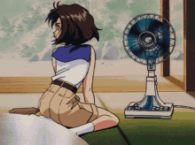

<h1 align="center">
  
</h1>

  
  

- 👋 Hi, I’m @[sogood99](https://github.com/sogood99/)
- 👀 I’m interested in [Manifold Theory](https://en.wikipedia.org/wiki/Differentiable_manifold), [Discrete Differential Geometry](https://en.wikipedia.org/wiki/Discrete_differential_geometry), and [Homotopy Type Theory](https://en.wikipedia.org/wiki/Homotopy_type_theory)
- 🌱 I’m currently learning aforementioned interest
- 📫 I live on something with boundary homeomorphic to a [2-sphere](https://en.wikipedia.org/wiki/Earth)

  

  

  

<!---
sogood99/sogood99 is a ✨ special ✨ repository because its `README.md` (this file) appears on your GitHub profile.
You can click the Preview link to take a look at your changes.
--->
